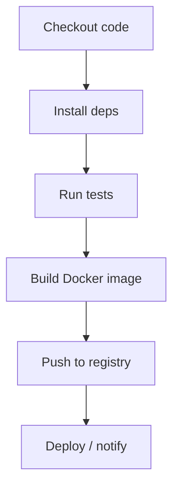

# CI/CD Pipeline Project

> Repository: https://github.com/HirenMahida007/docker-cicd-pipeline-project

A lightweight, full‑stack demonstration of continuous integration and deployment
using a simple Node.js service, Docker, and an optional Python/Streamlit frontend.
It's designed as an internship portfolio piece to show the core concepts of modern
DevOps workflows in a minimal codebase.

---

## 🚀 Overview

This repository contains a tiny application whose sole purpose is to add two numbers.
While the business logic is trivial, the value of the project lies in how the code is
built, tested, containerized and published through an automated pipeline. It covers:

- Node.js service with unit tests
- Dockerfile for containerization
- A Streamlit frontend for interactive demonstrations
- Example CI/CD configuration (GitHub Actions, Jenkins, etc.) can be plugged in

## 🗂 Project Structure

```
app.js              # Node.js entry point (exports add function)
Dockerfile          # Builds a container running the Node app
package.json        # Node dependencies and npm scripts
test.js             # Simple sanity test for the add function
streamlit_app.py    # Optional Python UI to call add(a, b)
requirements.txt    # Python deps for the Streamlit app
README.md           # This file
```

## 🛠 Technology Stack

- **Node.js** for the core application
- **npm** for dependency management and scripts
- **Docker** to package the app into an image
- **Python & Streamlit** as a lightweight GUI layer
- **GitHub** (or any Git provider) hosting the repo
- **CI/CD tools** such as GitHub Actions, Travis CI, or Jenkins for pipelines

**Quick reference table:**

| Component      | Purpose                                   |
|----------------|-------------------------------------------|
| Node.js        | Core service logic                        |
| npm            | Dependency management / scripts           |
| Docker         | Build and run container                   |
| Streamlit      | Interactive frontend demo (optional)      |
| GitHub Actions | Automate build/test/deploy                |
| Python         | Required for Streamlit UI                 |

## 📦 Getting Started

Follow these steps to run the project locally.

### Node.js service

```bash
# install Node dependencies
npm install

# run the service (prints result to console)
node app.js

# execute the basic test
node test.js
```

### Docker

```bash
# build the image
docker build -t cicd-pipeline .

# run the container (should output a result)
docker run --rm cicd-pipeline
```

### Streamlit Frontend (optional)

```bash
# install Python requirements
pip install -r requirements.txt

# start the UI in your browser
streamlit run streamlit_app.py
```

The frontend lets you input two numbers and see the result, illustrating how the
same logic can be consumed by different layers.

## 📈 CI/CD Pipeline (Concept)

To demonstrate continuous integration and delivery, add a pipeline configuration
in `.github/workflows` or equivalent:

1. **Checkout** code
2. **Install** dependencies
3. **Run tests** (`node test.js`)
4. **Build Docker image**
5. **Push image** to a registry or deploy to a staging environment
6. **(Optional)** Trigger Streamlit deployment

Below is a simple flowchart showing the stages:



This project is intentionally small so the pipeline stays fast and easy to follow.
During an interview, you can explain each stage and show the Git history where the
pipeline ran.

## ✨ Highlights for Internship

- Clear separation of concerns with readable code
- Demonstrates understanding of containerization and automated pipelines
- Easy to extend with new features or integrate with cloud services
- Minimal dependencies make it ideal for quick demos and live coding

## 📄 License

MIT License – feel free to fork and adapt for your own projects.

---

Thanks for checking out the repository! Feel free to clone it, run the examples,
and use it as a talking point in your internship interviews.