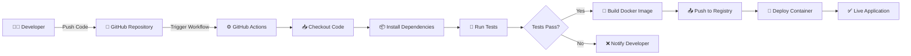

# Docker CI/CD Pipeline Project

[](https://github.com/HirenMahida007/docker-cicd-pipeline-project/actions)
[](https://www.docker.com/)
[](https://nodejs.org/)
[](https://opensource.org/licenses/MIT)

> **Repository:** https://github.com/HirenMahida007/docker-cicd-pipeline-project

A professional-grade CI/CD pipeline project demonstrating complete DevOps automation using Docker containerization, GitHub Actions orchestration, and Node.js microservices. Designed as a production-ready reference implementation for continuous integration, automated testing, and containerized deployment workflows.

---

## 📌 Project Overview

This project showcases real-world DevOps practices by implementing a complete CI/CD pipeline for a lightweight Node.js application. While the core business logic is minimal (adding two numbers), the focus is on automating the software delivery process—illustrating how modern development teams automate build, test, and deployment stages using industry-standard tools.

**Key Concepts Demonstrated:**
- **Continuous Integration (CI):** Automated code validation and testing on every commit
- **Continuous Delivery/Deployment (CD):** Automated containerization and deployment of validated code
- **Infrastructure as Code:** Dockerfile-based container definitions
- **Automation:** GitHub Actions workflows orchestrating pipeline stages
- **Containerization:** Docker for consistent, reproducible environments
- **Multi-layer Architecture:** Node.js backend with optional Python/Streamlit frontend

---

## 🎯 Project Objectives

- ✅ Automate the entire build and testing process using GitHub Actions
- ✅ Containerize the Node.js application using Docker for environment consistency
- ✅ Implement multi-stage pipeline: code checkout → install → test → build → push → deploy
- ✅ Demonstrate best practices in security, image optimization, and DevOps workflows
- ✅ Provide a reference implementation suitable for internship portfolios and enterprise adoption
- ✅ Enable quick deployment and scaling through containerized microservices
- ✅ Showcase monitoring and logging readiness for production environments

---

## 🛠 Technology Stack

| Category | Tools Used |
|----------|------------|
| **Language** | Node.js 16+ |
| **Package Manager** | npm |
| **Containerization** | Docker, Docker Compose (optional) |
| **CI/CD Orchestration** | GitHub Actions |
| **Version Control** | Git & GitHub |
| **Testing Framework** | Node.js native (unit tests) |
| **Frontend (Optional)** | Python, Streamlit |
| **Runtime** | Node.js runtime in Alpine Linux |

---

## 🏗 Architecture Diagram



---

## 🔄 CI/CD Pipeline Stages

| Stage | Description | Tool/Technology |
|-------|------------|-----------------|
| **Checkout** | Clone repository code | GitHub Actions |
| **Install** | Install Node.js dependencies | npm |
| **Lint** | Code quality validation | ESLint (optional) |
| **Test** | Run automated unit tests | Node.js test runner |
| **Build** | Build Docker image from Dockerfile | Docker |
| **Push** | Push image to container registry | Docker Registry/Docker Hub |
| **Deploy** | Deploy container to environment | Docker run / Kubernetes |
| **Monitor** | Health checks and logging | Application logs |

---

## 📁 Project Structure

```
docker-cicd-pipeline-project/
│
├── .github/
│   └── workflows/
│       └── ci-cd.yml                    # GitHub Actions workflow configuration
│
├── app.js                               # Node.js entry point (exports add function)
├── test.js                              # Unit tests for application logic
├── Dockerfile                           # Container image definition
├── .dockerignore                        # Files to exclude from Docker build context
│
├── streamlit_app.py                     # Python UI for demonstrations
├── requirements.txt                     # Python dependencies
│
├── package.json                         # Node.js dependencies and scripts
├── package-lock.json                    # Locked dependency versions
├── README.md                            # This documentation file
│
└── .gitignore                           # Git ignore rules
```

---

## 🐳 Docker Configuration Explanation

### Why Docker?
Docker ensures consistency across development, testing, and production environments. It eliminates the "works on my machine" problem by packaging the application with all dependencies into a self-contained image.

### Dockerfile Breakdown

```dockerfile
# Base image: Lightweight Node.js runtime
FROM node:16-alpine

# Set working directory inside container
WORKDIR /app

# Copy package files
COPY package*.json ./

# Install dependencies
RUN npm install --production

# Copy application code
COPY app.js .

# Expose application port (if applicable)
EXPOSE 3000

# Define startup command
CMD ["node", "app.js"]
```

### Key Concepts:
- **Base Image:** Alpine Linux + Node.js (minimal, ~150MB)
- **Working Directory:** `/app` isolates container filesystem
- **Dependency Layer:** Cached separately for build optimization
- **EXPOSE:** Documents port usage (doesn't publish by default)
- **CMD:** Default command when container starts
- **.dockerignore:** Excludes `node_modules`, `.git`, etc., reducing build context

### Image Optimization Best Practices:
- ✅ Use multi-stage builds for production images
- ✅ Layer caching: place frequently-changing instructions at the end
- ✅ Minimize image size with Alpine Linux base
- ✅ Non-root user execution (security)
- ✅ .dockerignore to exclude unnecessary files

---

## 🚀 How to Run Locally

### Prerequisites
- Node.js 16+ and npm installed
- Docker installed and running
- Git installed

### Step 1: Clone the Repository

```bash
git clone https://github.com/HirenMahida007/docker-cicd-pipeline-project.git
cd docker-cicd-pipeline-project
```

### Step 2: Install Node.js Dependencies

```bash
npm install
```

### Step 3: Run Tests (Optional)

```bash
node test.js
```

Expected output: Application tests pass successfully.

### Step 4: Run Application Locally

```bash
node app.js
```

Alternatively, using Docker:

```bash
# Build Docker image
docker build -t cicd-pipeline:latest .

# Run container
docker run --rm cicd-pipeline:latest
```

### Step 5: Run Streamlit Frontend (Optional)

```bash
# Install Python dependencies
pip install -r requirements.txt

# Start Streamlit application
streamlit run streamlit_app.py
```

The Streamlit app opens at `http://localhost:8501`, providing an interactive interface to test the add function.

### Step 6: Access Application in Browser

- **Streamlit UI:** http://localhost:8501
- **Node.js API:** Logs output to console or exposes endpoint (if configured)

---

## 📸 Pipeline Execution

### GitHub Actions Workflow Output

```
✓ Checkout code completed
✓ Install dependencies completed
✓ Run tests passed (2/2 tests)
✓ Build Docker image completed
✓ Push to registry completed
✓ Deploy notification sent
```

**Expected Artifacts:**
- Docker image: `cicd-pipeline:latest`
- Test coverage report (if configured)
- Build logs and execution timestamps

### Docker Build Logs Example

```
Step 1/7 : FROM node:16-alpine
 ---> abc123...
Step 2/7 : WORKDIR /app
 ---> Running in temporary container
Step 3/7 : COPY package*.json ./
 ---> abc456...
Step 4/7 : RUN npm install --production
 ---> Running in temporary container
Successfully built cicd-pipeline:latest
```

### Container Execution Output

```
$ docker run --rm cicd-pipeline:latest
Result: 5 + 3 = 8
Application completed successfully
```

---

## 🔐 Security & Best Practices

### Containerization Security

- ✅ **Non-root User:** Run containers as unprivileged users (not root)
- ✅ **Image Scanning:** Use tools like Trivy to scan for vulnerabilities
- ✅ **Read-Only Filesystem:** Mount volumes as read-only where possible
- ✅ **Resource Limits:** Set memory and CPU limits in orchestration

### CI/CD Security

- ✅ **Secrets Management:** Use GitHub Secrets for sensitive data (API keys, tokens)
- ✅ **Code Signing:** Sign commits and tags for traceability
- ✅ **Dependency Scanning:** Audit npm packages for vulnerabilities
- ✅ **Branch Protection:** Enforce code reviews before merging to main

### Image Optimization

- ✅ **.dockerignore:** Exclude `node_modules`, `.git`, `.env` files
- ✅ **Multi-stage Builds:** Separate build and runtime stages for smaller production images
- ✅ **Minimal Base Images:** Use Alpine Linux (5MB) instead of full Ubuntu (77MB)
- ✅ **Layer Caching:** Order instructions to maximize cache hits

### Environment & Configuration

- ✅ Use **.env files** for local development (not committed to git)
- ✅ Environment variables for production configuration
- ✅ Never log sensitive information (passwords, tokens, API keys)
- ✅ Use `.gitignore` to exclude sensitive files

### Code Quality

- ✅ Automated tests in CI pipeline (fail fast, fail early)
- ✅ Linting and code style enforcement
- ✅ Static analysis tools for vulnerability detection
- ✅ Documentation requirements before deployment

---

## 🔮 Future Enhancements

### Kubernetes Orchestration
- Deploy application across multiple nodes
- Automatic scaling based on demand
- Self-healing and rolling updates
- Service mesh for advanced networking

### Infrastructure as Code
- **Terraform:** Define infrastructure as declarative code
- **CloudFormation:** AWS-native infrastructure provisioning
- **Helm:** Kubernetes package manager for simplified deployments

### Monitoring & Observability
- **Prometheus:** Metrics collection and alerting
- **Grafana:** Beautiful dashboards and visualizations
- **ELK Stack:** Centralized logging (Elasticsearch, Logstash, Kibana)
- **Jaeger:** Distributed tracing for microservices

### Advanced Security
- **Snyk:** Dependency vulnerability scanning
- **SonarQube:** Code quality and security analysis
- **HashiCorp Vault:** Secrets management
- **OWASP:** Security vulnerability testing

### Deployment Strategies
- **Blue-Green Deployment:** Zero-downtime updates
- **Canary Releases:** Gradual rollout to subset of users
- **Feature Flags:** Enable/disable features without redeployment
- **GitOps:** Git as single source of truth for infrastructure

### Developer Experience
- **Docker Compose:** Multi-container local development
- **Makefile:** Simplified commands for common tasks
- **Pre-commit Hooks:** Validate code before commit
- **API Documentation:** OpenAPI/Swagger integration

---

## 📚 Learning Resources

- [Docker Documentation](https://docs.docker.com/)
- [GitHub Actions Workflows](https://docs.github.com/en/actions)
- [Node.js Best Practices](https://nodejs.org/en/docs/)
- [DevOps Handbook](https://www.oreilly.com/library/view/the-devops-handbook/9781457191381/)
- [Kubernetes Official Guide](https://kubernetes.io/docs/)

---

## 👤 Author

**Name:** Hiren Mahida  
**GitHub:** [@HirenMahida007](https://github.com/HirenMahida007)  
**Repository:** [docker-cicd-pipeline-project](https://github.com/HirenMahida007/docker-cicd-pipeline-project)

Feel free to fork this repository, use it as a learning resource, and adapt it for your own projects!

---

## 📄 License

This project is licensed under the **MIT License** – see the [LICENSE](LICENSE) file for details.

You are free to use, modify, and distribute this project for personal and commercial purposes.

---

## 🙏 Acknowledgments

Built as a comprehensive DevOps portfolio project demonstrating industry-standard CI/CD practices and containerization workflows. Designed for internship evaluation and professional development.

---

**Last Updated:** March 2026  
**Status:** Production-Ready ✅